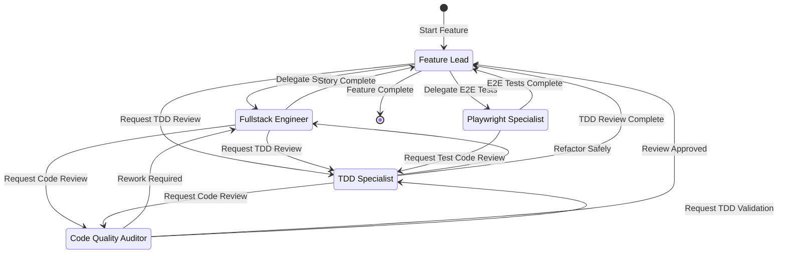
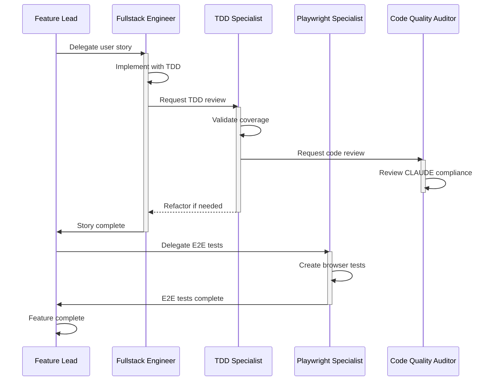

Als# Product Development Workflow

Agent handoff state diagrams documenting how agents coordinate during feature development.

## Complete Handoff Map

```
┌─────────────────────────────────────────────────────────────────────────────────┐
│                           AGENT HANDOFF WORKFLOW                                 │
└─────────────────────────────────────────────────────────────────────────────────┘

                              ┌──────────────────┐
                              │   FEATURE LEAD   │◄─────────────────────────────┐
                              │   (Orchestrator) │                              │
                              └────────┬─────────┘                              │
                                       │                                        │
           ┌───────────────────────────┼────────────────────────────┐           │
           │                           │                            │           │
           ▼                           ▼                            ▼           │
┌──────────────────┐      ┌──────────────────┐      ┌──────────────────────┐    │
│    FULLSTACK     │◄─────│  TDD SPECIALIST  │◄─────│ PLAYWRIGHT SPECIALIST│    │
│    ENGINEER      │      │                  │      │    (E2E Testing)     │    │
│  (Playwright*)   │      │                  │      │                      │    │
└────────┬─────────┘      └────────┬─────────┘      └──────────┬───────────┘    │
         │                         │  ▲                        │               │
         │                         │  │                        │               │
         ▼                         ▼  │                        │               │
┌──────────────────┐      ┌──────────────────┐                 │               │
│  TDD SPECIALIST  │─────►│  CODE QUALITY    │                 │               │
│                  │      │    AUDITOR       │─────────────────┼───────────────┘
└──────────────────┘      └────────┬─────────┘                 │
                                   │                           │
                                   │          ┌────────────────▼────────────┐
                                   └──────────┤   DEVOPS SPECIALIST         │
                                              │   (CI/CD Automation)        │
                                              └─────────────────────────────┘
                                                 (Routes to: Feature Lead)

═══════════════════════════════════════════════════════════════════════════════════
                              POST-MERGE WORKFLOW
═══════════════════════════════════════════════════════════════════════════════════

┌──────────────────┐      ┌───────────────────┐      ┌─────────────────────────┐
│   FEATURE LEAD   │─────►│ RETRO SPECIALIST  │─────►│ AGENT PACKAGE MANAGER   │
│ (Story Merged)   │      │  (Facilitates)    │      │ (Implements Changes)    │
└──────────────────┘      └─────────┬─────────┘      └─────────────────────────┘
                                    │
                          ┌─────────┴─────────┐
                          │ Gathers Input From│
                          ├───────────────────┤
                          │ • TDD Specialist  │
                          │ • Fullstack Eng   │
                          │ • Playwright Spec │
                          │ • Code Quality    │
                          └───────────────────┘
```

## Agents Overview

| Agent | Role | Phase | Version | Model |
|-------|------|-------|---------|-------|
| **feature-lead** | Orchestrator - coordinates multi-story features | Development | - | Claude Opus 4.5 |
| **fullstack-engineer** | Implementation with Playwright integration verification | Development | v2.4.0 | Claude Sonnet 4.5 |
| **tdd-specialist** | Quality - enforces TDD discipline | Development | - | Claude Sonnet 4.5 |
| **playwright-specialist** | E2E Testing - browser automation | Integration | - | Claude Sonnet 4.5 |
| **code-quality-auditor** | Review - CLAUDE Framework compliance | Quality Gate | - | Claude Sonnet 4.5 |
| **devops-specialist** | CI/CD - GitHub Actions, Docker, deployment automation | Continuous | v1.0.0 | Claude Sonnet 4.5 |
| **retro-specialist** | Facilitation - retrospectives with subagent consultation | Post-Merge | v1.2.0 | Claude Sonnet 4.5 |
| **agent-package-manager** | Maintenance - implements process improvements | Continuous | - | Claude Sonnet 4.5 |

## Handoff Table

| From Agent | To Agent | Trigger Label | Auto-Send | Purpose |
|------------|----------|---------------|-----------|---------|
| **feature-lead** | fullstack-engineer | "Delegate to Fullstack Engineer" | ✅ | Implement user story |
| **feature-lead** | tdd-specialist | "Request TDD Review" | ✅ | Review test coverage |
| **feature-lead** | playwright-specialist | "Delegate E2E Test Automation" | ✅ | Create E2E tests |
| **fullstack-engineer** | tdd-specialist | "Request TDD Review" | ✅ | Review TDD compliance |
| **fullstack-engineer** | feature-lead | "Report Completion to Feature Lead" | ✅ | Story complete |
| **fullstack-engineer** | code-quality-auditor | "Request Code Quality Review" | ✅ | CLAUDE Framework review |
| **tdd-specialist** | code-quality-auditor | "Request Code Review" | ✅ | Review quality |
| **tdd-specialist** | fullstack-engineer | "Refactor Safely" | ✅ | Keep tests passing |
| **tdd-specialist** | feature-lead | "TDD Review Complete" | ✅ | Return to orchestrator |
| **playwright-specialist** | feature-lead | "E2E Tests Complete" | ✅ | Automation done |
| **playwright-specialist** | tdd-specialist | "Request Test Code Review" | ✅ | Review E2E test quality |
| **code-quality-auditor** | fullstack-engineer | "Rework Required" | ✅ | Fix identified issues |
| **code-quality-auditor** | feature-lead | "Review Approved" | ✅ | Quality gate passed |
| **code-quality-auditor** | tdd-specialist | "Request TDD Validation" | ✅ | Validate test coverage |
| **feature-lead** | devops-specialist | "Set Up CI/CD Pipeline" | ✅ | Automate testing and deployment |
| **devops-specialist** | feature-lead | "Pipeline Ready" | ✅ | CI/CD automation complete |
| **feature-lead** | retro-specialist | "Run Story Retrospective" | ✅ | Facilitate retro after merge |
| **retro-specialist** | agent-package-manager | "Implement Process Improvements" | ✅ | Update primitives + propagate to dependent projects |
| **retro-specialist** | feature-lead | "Retro Complete" | ✅ | Return to orchestrator |

> **Note**: All handoffs are autonomous (`send: true`) - no manual approval required.

## Workflow Paths

### Path 1: Standard Feature Development

The primary workflow for implementing user stories:

```
┌──────────────┐     ┌───────────────────┐     ┌────────────────┐     ┌─────────────────────┐
│ Feature Lead │────►│ Fullstack Engineer│────►│ TDD Specialist │────►│ Code Quality Auditor│
└──────────────┘     └─────────┬─────────┘     └────────────────┘     └─────────────────────┘
       ▲                       │                                                │
       │                       │                                                │
       └───────────────────────┴────────────────────────────────────────────────┘
                                    Story Complete
```

**Steps**:
1. Feature Lead delegates user story to Fullstack Engineer
2. Fullstack Engineer implements with TDD discipline
3. Fullstack Engineer requests TDD review
4. TDD Specialist validates coverage and compliance
5. TDD Specialist requests code quality review
6. Code Quality Auditor reviews against CLAUDE Framework
7. Fullstack Engineer reports completion to Feature Lead

### Path 2: E2E Test Automation

Parallel path for end-to-end testing:

```
┌──────────────┐     ┌───────────────────────┐     ┌──────────────┐
│ Feature Lead │────►│ Playwright Specialist │────►│ Feature Lead │
└──────────────┘     └───────────────────────┘     └──────────────┘
```

**Steps**:
1. Feature Lead delegates E2E test creation
2. Playwright Specialist creates comprehensive tests
3. Playwright Specialist reports completion with test status

### Path 3: TDD Refactoring Cycle

Iterative loop for code improvement:

```
┌────────────────┐     ┌───────────────────┐
│ TDD Specialist │◄───►│ Fullstack Engineer│
└───────┬────────┘     └───────────────────┘
        │                    (Refactor)
        ▼
┌─────────────────────┐
│ Code Quality Auditor│
└─────────────────────┘
```

**Steps**:
1. TDD Specialist identifies refactoring needs
2. Fullstack Engineer refactors while keeping tests passing
3. TDD Specialist validates tests still pass
4. TDD Specialist requests final code review

### Path 4: Retrospective and Continuous Improvement

Post-merge learning cycle:

```
┌──────────────┐     ┌──────────────────┐     ┌─────────────────────────┐
│ Feature Lead │────►│ Retro Specialist │────►│ Agent Package Manager   │
└──────────────┘     └────────┬─────────┘     └─────────────────────────┘
    (Merged)                  │                   (Implements Changes)
                              │
                    ┌─────────┴─────────┐
                    │  Gathers Input:   │
                    │  • TDD Specialist │
                    │  • Fullstack Eng  │
                    │  • Playwright     │
                    │  • Code Quality   │
                    └───────────────────┘
```

**Steps**:
1. Feature Lead triggers retro after story merge
2. Retro Specialist **consults domain experts as subagents** using `runSubagent` tool:
   - TDD Specialist: Test coverage and discipline feedback
   - Fullstack Engineer: Implementation challenges and wins
   - Playwright Specialist: Integration testing insights
   - Code Quality Auditor: Quality patterns observed
   - Feature Lead: Coordination and workflow feedback
3. Retro Specialist synthesizes structured YAML feedback from all subagents
4. Retro Specialist creates handoff spec for Agent Package Manager
5. Agent Package Manager implements process improvements:
   - **Update**: Modify primitives (agents, prompts, instructions)
   - **Version**: Bump version in `apm.yml` (MANDATORY for any primitive change)
   - **Commit**: Push to agent-packages repository
   - **Propagate**: Run `apm install --update` in dependent projects (e.g., birdmate)
   - **Dependencies**: Add new primitives to project's `apm.yml` if created
   - **Validate**: Verify integration in `.github/` or `.claude/` directories
6. Agent Package Manager updates `.memory/retro-log.md` and commits to dependent projects

**Innovation**: Subagent consultation (v1.2.0) enables structured multi-perspective feedback without manual coordination.

## User Story Lifecycle

### Story State Transitions

```
┌──────────────────────────────────────────────────────────────────────────────┐
│                          USER STORY LIFECYCLE                                 │
└──────────────────────────────────────────────────────────────────────────────┘

    [Backlog]
        │
        │ Feature Lead picks story
        ▼
    [In Progress] ──────────────────────────────────┐
        │                                            │
        │ Implementation complete                    │
        │ + All unit tests passing                   │
        │ + Integration verification done            │
        ▼                                            │
    [Ready for Review] ◄──────────────────────┐     │
        │                                      │     │
        │ TDD compliance validated             │     │
        │ + Code quality review passed         │     │ Defects
        ▼                                      │     │ Found
    [Ready for Acceptance]                     │     │
        │                                      │     │
        │ E2E tests passing                    │     │
        │ + Integration demo successful   ┌────┴─────┴────┐
        │ + Product owner accepts         │  Rework Loop  │
        ▼                                 │               │
    [Done]                                │ • Fix defects │
        │                                 │ • Re-test     │
        │ Merged to main                  │ • Re-review   │
        ▼                                 └───────────────┘
    [Retrospective]
        │
        │ Process improvements captured
        ▼
    [Continuous Improvement]
```

### Gate Criteria (Entry/Exit Conditions)

| Transition | Entry Criteria | Agent Handoff | Exit Criteria | Blocking Issues |
|------------|----------------|---------------|---------------|-----------------|
| **Backlog → In Progress** | Story refined with acceptance criteria | Feature Lead → Fullstack Engineer | Story assigned, branch created | None |
| **In Progress → Ready for Review** | • All unit tests passing<br>• Integration verification complete<br>• Evidence captured (screenshots, logs) | Fullstack Engineer → TDD Specialist | TDD Specialist accepts review request | • Test failures<br>• Missing integration evidence |
| **Ready for Review → Ready for Acceptance** | • TDD compliance validated<br>• Code quality review passed (Grade C+ minimum) | TDD Specialist → Code Quality Auditor → Feature Lead | Quality gate approved, all tests green | • TDD violations<br>• CLAUDE audit < C+<br>• Integration issues |
| **Ready for Acceptance → Done** | • E2E tests passing<br>• Integration demo successful<br>• Product owner approves | Feature Lead → (merge) | Merged to main | • E2E test failures<br>• Acceptance rejected |
| **Done → Retrospective** | Story merged | Feature Lead → Retro Specialist | Retrospective complete | None |

### Defect Handling Workflows

#### 1. TDD Compliance Defects

```
TDD Specialist finds issues
        │
        ├─ Missing tests → Fullstack Engineer (add tests)
        ├─ Coverage < 80% → Fullstack Engineer (increase coverage)
        ├─ Tests not failing first → Fullstack Engineer (fix TDD cycle)
        └─ Refactoring breaks tests → Fullstack Engineer (fix implementation)
                │
                ▼
        Fullstack Engineer fixes
                │
                ▼
        TDD Specialist re-reviews → [Ready for Review]
```

**Agent Handoff**: `TDD Specialist → Fullstack Engineer ("Refactor Safely")` → back to TDD Specialist

#### 2. Code Quality Defects

```
Code Quality Auditor finds issues
        │
        ├─ CLAUDE Framework violations → Fullstack Engineer (refactor)
        ├─ Security vulnerabilities → Fullstack Engineer (fix + add tests)
        ├─ Performance issues → Fullstack Engineer (optimize + benchmark)
        └─ Maintainability concerns → Fullstack Engineer (simplify)
                │
                ▼
        Fullstack Engineer fixes
                │
                ▼
        Code Quality Auditor re-reviews → [Ready for Acceptance]
```

**Agent Handoff**: `Code Quality Auditor → Fullstack Engineer ("Rework Required")` → back to Code Quality Auditor

#### 3. E2E Test Failures

```
Playwright Specialist finds failures
        │
        ├─ UI interaction broken → Fullstack Engineer (fix frontend)
        ├─ API contract violated → Fullstack Engineer (fix backend)
        ├─ Integration failure → Fullstack Engineer (debug + fix)
        └─ Race condition → Fullstack Engineer (add wait conditions)
                │
                ▼
        Fullstack Engineer fixes
                │
                ▼
        Playwright Specialist re-runs tests → [Ready for Acceptance]
```

**Agent Handoff**: `Playwright Specialist → Fullstack Engineer` → back to Playwright Specialist

#### 4. Integration Verification Defects (NEW - US-001 Learning)

```
Fullstack Engineer discovers during manual verification
        │
        ├─ CORS misconfiguration → Fix backend CORS_ORIGIN
        ├─ API type mismatch → Fix frontend types at boundaries
        ├─ Stale build files → Clean build, add to .gitignore
        └─ Network errors → Debug API contracts
                │
                ▼
        Fullstack Engineer fixes
                │
                ▼
        Re-run integration verification with Playwright tools
                │
                ▼
        Evidence captured → [Ready for Review]
```

**Agent Handoff**: Internal to Fullstack Engineer (self-correction before handing off)

#### 5. Acceptance Defects

```
Product Owner (Feature Lead) rejects during acceptance
        │
        ├─ Feature incomplete → Back to [In Progress]
        ├─ Acceptance criteria not met → Back to [In Progress]
        ├─ UX issues → Fullstack Engineer (refine UI)
        └─ Performance unacceptable → Fullstack Engineer (optimize)
                │
                ▼
        Fullstack Engineer addresses feedback
                │
                ▼
        Full review cycle → [Ready for Acceptance]
```

**Agent Handoff**: `Feature Lead → Fullstack Engineer` → full cycle restart

### Review vs Acceptance

| Aspect | Review (Quality Gate) | Acceptance (Product Validation) |
|--------|----------------------|----------------------------------|
| **Who** | TDD Specialist + Code Quality Auditor | Feature Lead (as Product Owner) |
| **What** | Technical quality, test coverage, code standards | Feature completeness, acceptance criteria met |
| **When** | After implementation, before acceptance | After all quality gates pass |
| **Criteria** | • TDD compliance<br>• CLAUDE Framework Grade C+<br>• Integration verified<br>• All tests passing | • All acceptance criteria met<br>• E2E tests passing<br>• Integration demo successful<br>• Meets product requirements |
| **Outcome** | Approved → Ready for Acceptance<br>Rejected → Back to In Progress | Approved → Merge to main<br>Rejected → Back to In Progress |
| **Handoff** | TDD/Code Quality → Feature Lead | Feature Lead → merge (no handoff) |

### Story State Mapping to Agent Handoffs

| Story State | Active Agent | Waiting On | Next Handoff |
|-------------|--------------|------------|--------------|
| **Backlog** | Feature Lead | Story prioritization | Feature Lead → Fullstack Engineer |
| **In Progress** | Fullstack Engineer | Implementation complete | Fullstack Engineer → TDD Specialist |
| **Ready for Review** | TDD Specialist, Code Quality Auditor | Quality gates pass | Code Quality Auditor → Feature Lead |
| **Ready for Acceptance** | Feature Lead | Product owner acceptance | Feature Lead → merge |
| **Done** | (none - merged) | Retrospective scheduling | Feature Lead → Retro Specialist |
| **Retrospective** | Retro Specialist | Process improvements | Retro Specialist → Agent Package Manager |

### Example: Complete Story Lifecycle with Handoffs

**US-002: Bird Species Detail Page**

```
1. [Backlog] → Feature Lead picks story
   Handoff: Feature Lead → Fullstack Engineer ("Delegate to Fullstack Engineer")

2. [In Progress] → Fullstack Engineer implements
   - Writes tests first (RED)
   - Implements features (GREEN)
   - Refactors (REFACTOR)
   - Runs integration verification with Playwright tools
   - Captures evidence (screenshots, console logs)
   
3. [In Progress → Ready for Review]
   Handoff: Fullstack Engineer → TDD Specialist ("Request TDD Review")
   
4. [Ready for Review] → TDD Specialist reviews
   - Validates coverage > 80%
   - Checks TDD discipline
   - Reviews refactoring quality
   Handoff: TDD Specialist → Code Quality Auditor ("Request Code Review")
   
5. [Ready for Review] → Code Quality Auditor reviews
   - CLAUDE Framework audit (Grade C+)
   - Security check
   - Performance validation
   
   🚫 DEFECT FOUND: Missing error handling
   Handoff: Code Quality Auditor → Fullstack Engineer ("Rework Required")
   
6. [Back to In Progress] → Fullstack Engineer fixes
   - Adds error handling with tests
   - Re-runs all tests
   Handoff: Fullstack Engineer → Code Quality Auditor ("Re-review")
   
7. [Ready for Review] → Code Quality Auditor approves
   Handoff: Code Quality Auditor → Feature Lead ("Review Approved")
   
8. [Ready for Acceptance] → Feature Lead validates
   - Runs E2E tests (all passing)
   - Reviews integration evidence
   - Validates acceptance criteria
   - Approves story
   
9. [Done] → Merge to main
   
10. [Retrospective] → Feature Lead triggers retro
    Handoff: Feature Lead → Retro Specialist ("Run Story Retrospective")
    
11. [Retrospective] → Retro Specialist facilitates
    - Consults 5 domain expert subagents
    - Synthesizes learnings
    Handoff: Retro Specialist → Agent Package Manager ("Implement Process Improvements")
    
12. [Continuous Improvement] → Agent Package Manager
    - Updates primitives (instructions, agents, prompts)
    - Bumps versions in apm.yml
    - Propagates to dependent projects
```

### Key Insights: How Handoffs Implement Lifecycle

1. **State transitions are driven by handoffs**: Each handoff moves the story through its lifecycle
2. **Defect loops are explicit handoffs**: "Rework Required" and "Refactor Safely" are rework mechanisms
3. **Quality gates block progression**: Story cannot reach "Ready for Acceptance" without passing all reviews
4. **Autonomous flow**: `send: true` on all handoffs means no manual intervention needed
5. **Evidence-based transitions**: Integration verification evidence required before review handoff
6. **Retrospective always happens**: Even successful stories trigger learning capture

## Pull Request (PR) Workflow

### PR Creation and Lifecycle

```
┌─────────────────────────────────────────────────────────────────────────────┐
│                         PULL REQUEST WORKFLOW                                │
└─────────────────────────────────────────────────────────────────────────────┘

[In Progress]
     │
     │ Fullstack Engineer completes implementation
     │ + Integration verification done with Playwright tools
     │ + Evidence captured (screenshots, console logs, network)
     ▼
[Create PR] ◄──────────────────────────────────────────────────────────┐
     │                                                                   │
     │ PR created with:                                                  │
     │ • Quality gate checklist                                          │
     │ • Integration evidence attached                                   │
     │ • Links to test results                                           │
     ▼                                                                   │
[CI Pipeline Executes]                                                   │
     │                                                                   │
     ├─ ✅ Unit Tests (Backend + Frontend)                              │
     ├─ ✅ Integration Tests                                            │
     ├─ ✅ E2E Tests (Playwright)                                       │
     ├─ ✅ Linting & Type Checking                                      │
     ├─ ✅ Code Coverage > 80%                                          │
     └─ ✅ Build Succeeds                                               │
         │                                                               │
         │ ❌ CI Fails → Fix defects, push changes ─────────────────────┘
         ▼
[Ready for Review]
     │
     │ Agents review (TDD Specialist, Code Quality Auditor)
     │ + Automated checks passed
     │ + Manual review passed
     ▼
[Ready for Acceptance]
     │
     │ Feature Lead validates
     │ + All quality gates passed
     │ + Acceptance criteria met
     ▼
[Approved & Merged]
     │
     ▼
[Done]
```

### When to Create PR

**Timing**: Create PR when transitioning from **In Progress → Ready for Review**

**Prerequisites** (blocking):
1. ✅ All unit tests passing locally
2. ✅ Integration verification complete (Playwright tools)
3. ✅ Evidence captured and ready to attach
4. ✅ Code committed to feature branch
5. ✅ Branch rebased on latest main

**Agent**: Fullstack Engineer creates PR before handoff to TDD Specialist

### PR Template with Quality Gate Checklist

```markdown
## User Story
**US-XXX**: [Story Title]

**Spec**: [Link to spec.md]
**Acceptance Criteria**: [Link or inline list]

---

## Quality Gates Checklist

### ✅ Implementation (Fullstack Engineer)
- [ ] All acceptance criteria implemented
- [ ] TDD workflow followed (RED → GREEN → REFACTOR)
- [ ] Integration verification completed with Playwright tools
- [ ] Evidence captured (see attachments below)

### ✅ Testing (Fullstack Engineer)
- [ ] Unit tests: Backend (XXX tests, XX% coverage)
- [ ] Unit tests: Frontend (XXX tests, XX% coverage)
- [ ] Integration tests passing
- [ ] E2E tests passing (Playwright)
- [ ] All tests green locally

### ✅ Integration Verification (Fullstack Engineer - MANDATORY)
- [ ] **CORS Configuration**: Multi-port support verified
- [ ] **API Type Contracts**: Frontend uses API-specific types
- [ ] **Build Hygiene**: No stale `.js`/`.jsx` files (using `.ts`/`.tsx`)
- [ ] **Evidence Attached**: Screenshots, console logs, network traces

### ✅ Code Quality (to be reviewed)
- [ ] TDD Compliance: Validated by TDD Specialist
- [ ] CLAUDE Framework Audit: Grade C+ or better (Code Quality Auditor)
- [ ] No security vulnerabilities
- [ ] Performance acceptable

### ✅ CI Pipeline (automated)
- [ ] All CI jobs passing (see checks below)
- [ ] No build warnings
- [ ] No linting errors
- [ ] Type checking passed

---

## Integration Evidence

### Screenshots


### Console Logs
```
[Clean console - no errors]
```

### Network Traces
```
✅ GET /api/birds - 200 OK (45ms)
✅ POST /api/search - 200 OK (120ms)
✅ CORS headers present
```

### Playwright Verification Session
- **Date**: YYYY-MM-DD
- **Duration**: X minutes
- **Result**: All interactions successful
- **Evidence**: [Link to .playwright-mcp/ screenshots]

---

## Test Results

### Unit Tests
- **Backend**: XXX tests, XX.X% coverage
  ```
  Test Suites: X passed, X total
  Tests:       X passed, X total
  ```

- **Frontend**: XXX tests, XX.X% coverage
  ```
  Test Suites: X passed, X total
  Tests:       X passed, X total
  ```

### E2E Tests
```
X passed (Xm XXs)
```

---

## Agent Reviews

### TDD Specialist Review
- [ ] Pending / ✅ Approved / ❌ Rejected
- **Comments**: [TDD Specialist feedback]

### Code Quality Auditor Review
- [ ] Pending / ✅ Approved / ❌ Rejected
- **CLAUDE Audit Grade**: [Grade]
- **Comments**: [Code Quality Auditor feedback]

---

## Acceptance Validation

### Feature Lead Sign-off
- [ ] Pending / ✅ Approved / ❌ Rejected
- **Acceptance Criteria**: All met
- **Demo Result**: Successful
- **Comments**: [Feature Lead feedback]

---

## Links
- Spec: [link]
- Test Coverage Report: [link]
- CI Pipeline Run: [link to GitHub Actions]
- Retrospective: [to be added after merge]
```

### CI Pipeline Jobs (DevOps Specialist Setup)

**GitHub Actions Workflow** (`.github/workflows/integration.yml`):

```yaml
name: Integration Tests

on:
  pull_request:
    branches: [main]

jobs:
  unit-tests-backend:
    runs-on: ubuntu-latest
    steps:
      - uses: actions/checkout@v3
      - name: Run backend tests
      - run: cd backend && npm test
      - name: Check coverage
      - run: cd backend && npm run coverage:check  # Fails if < 80%

  unit-tests-frontend:
    runs-on: ubuntu-latest
    steps:
      - uses: actions/checkout@v3
      - name: Run frontend tests
      - run: cd frontend && npm test
      - name: Check coverage
      - run: cd frontend && npm run coverage:check  # Fails if < 80%

  integration-tests:
    runs-on: ubuntu-latest
    steps:
      - uses: actions/checkout@v3
      - name: Start services
      - run: docker compose -f compose.ci.yml up -d
      - name: Wait for services
      - run: ./scripts/wait-for-services.sh
      - name: Run integration tests
      - run: npm run test:integration

  e2e-tests:
    runs-on: ubuntu-latest
    steps:
      - uses: actions/checkout@v3
      - uses: microsoft/playwright-github-action@v1
      - name: Start app
      - run: docker compose up -d
      - name: Run E2E tests
      - run: npm run test:e2e

  quality-checks:
    runs-on: ubuntu-latest
    steps:
      - uses: actions/checkout@v3
      - name: Lint
      - run: npm run lint
      - name: Type check
      - run: npm run type-check
      - name: Build
      - run: npm run build

  # All jobs must pass for PR to be mergeable
  all-checks:
    needs: [unit-tests-backend, unit-tests-frontend, integration-tests, e2e-tests, quality-checks]
    runs-on: ubuntu-latest
    steps:
      - run: echo "All checks passed ✅"
```

### PR State Mapping to Story Lifecycle

| PR State | Story State | CI Status | Agent Activity |
|----------|-------------|-----------|----------------|
| **Draft** | In Progress | Not triggered | Fullstack Engineer working |
| **Open (Ready for Review)** | Ready for Review | CI running | TDD Specialist + Code Quality Auditor reviewing |
| **Changes Requested** | In Progress | CI may be failing | Fullstack Engineer fixing defects |
| **Approved** | Ready for Acceptance | CI passing | Feature Lead validates |
| **Merged** | Done | Final CI on main | Retrospective triggered |

### Evidence Requirements in PR

**MANDATORY attachments** (from US-001 retrospective learnings):

1. **Integration Screenshots** (`.playwright-mcp/` or `evidence/`)
   - Home page loaded successfully
   - Search interaction working
   - Results displayed correctly
   - Detail pages functioning

2. **Browser Console Logs**
   - Copy/paste showing no errors
   - Or screenshot of clean console

3. **Network Traces**
   - API requests with status codes
   - Response times
   - CORS headers verification

4. **Test Coverage Reports**
   - Backend coverage badge/link
   - Frontend coverage badge/link
   - Must be > 80%

5. **CI Pipeline Link**
   - GitHub Actions run URL
   - All jobs green

### PR Review Flow with Agents

```
Fullstack Engineer creates PR
        │
        ├─ Attaches evidence
        ├─ Fills quality gate checklist
        └─ Requests review from @tdd-specialist
        │
        ▼
CI Pipeline executes (automated)
        │
        ├─ ✅ All jobs passing → Continue
        └─ ❌ Any job failing → Changes requested (back to Fullstack Engineer)
        │
        ▼
TDD Specialist reviews
        │
        ├─ Validates TDD compliance
        ├─ Checks test quality
        └─ Requests @code-quality-auditor review
        │
        ▼
Code Quality Auditor reviews
        │
        ├─ CLAUDE Framework audit
        ├─ Security scan
        ├─ Performance check
        └─ Approves or requests changes
        │
        ▼
Feature Lead validates
        │
        ├─ Acceptance criteria met?
        ├─ All evidence satisfactory?
        └─ Approves and merges
        │
        ▼
Merged to main → CI runs final checks → Retrospective
```

### Automated vs Manual Gates

| Gate | Automated (CI) | Manual (Agent Review) |
|------|----------------|----------------------|
| **Unit Tests** | ✅ CI fails if < 80% coverage | TDD Specialist validates quality |
| **Integration Tests** | ✅ CI runs full suite | TDD Specialist reviews test design |
| **E2E Tests** | ✅ CI runs Playwright tests | Playwright Specialist reviews test coverage |
| **Linting** | ✅ CI fails on errors | Code Quality Auditor checks style |
| **Type Checking** | ✅ CI fails on errors | Code Quality Auditor validates types |
| **Build** | ✅ CI fails if build broken | N/A |
| **CORS Config** | ❌ Manual verification | Fullstack Engineer attaches evidence |
| **API Contracts** | ❌ Manual verification | Fullstack Engineer attaches evidence |
| **Build Hygiene** | ❌ Manual verification | Fullstack Engineer attaches evidence |
| **TDD Discipline** | ❌ Cannot automate | TDD Specialist validates RED→GREEN→REFACTOR |
| **CLAUDE Framework** | ❌ Cannot automate | Code Quality Auditor performs audit |
| **Acceptance Criteria** | ❌ Product decision | Feature Lead validates |

### PR Approval Rules (GitHub Branch Protection)

**DevOps Specialist configures**:

```yaml
# Branch protection for main
required_status_checks:
  strict: true
  checks:
    - unit-tests-backend
    - unit-tests-frontend
    - integration-tests
    - e2e-tests
    - quality-checks

required_reviews:
  required_approving_reviews: 2  # TDD Specialist + Code Quality Auditor
  dismiss_stale_reviews: true
  require_code_owner_reviews: true

restrictions:
  required_linear_history: true
  allow_force_pushes: false
  allow_deletions: false
```

### Example: PR Lifecycle with CI

**US-002 Pull Request**:

```
1. Fullstack Engineer creates PR
   - Title: "US-002: Bird Species Detail Page"
   - Branch: feat-us2 → main
   - Evidence attached (3 screenshots, console logs, network traces)
   - Quality gate checklist filled

2. CI Pipeline executes (5 minutes)
   ✅ Backend tests: 145 passed, 85% coverage
   ✅ Frontend tests: 89 passed, 82% coverage
   ✅ Integration tests: 12 passed
   ✅ E2E tests: 8 passed
   ✅ Linting: No errors
   ✅ Type check: No errors
   ✅ Build: Success

3. TDD Specialist review (agent)
   - Reviews test quality
   - Validates TDD commits (RED→GREEN→REFACTOR pattern in git log)
   - ✅ Approves: "Excellent test coverage and discipline"

4. Code Quality Auditor review (agent)
   - CLAUDE Framework audit: Grade B (25/30)
   - Security scan: No vulnerabilities
   - Performance: Acceptable
   - ✅ Approves: "Meets quality standards"

5. Feature Lead review (product owner)
   - Validates acceptance criteria (all 5 met)
   - Reviews integration evidence
   - Runs live demo (successful)
   - ✅ Approves and merges

6. Merged to main
   - Final CI run: All checks passing
   - Deployed to staging (automatic)

7. Retrospective triggered
   - Feature Lead → Retro Specialist handoff
```

### Key Benefits of PR Workflow

1. **CI automates repetitive checks** (tests, linting, build)
2. **Evidence is permanently attached** to PR (audit trail)
3. **Quality gates are explicit** in checklist (transparency)
4. **Agent reviews are structured** (clear expectations)
5. **Defect loops are visible** (changes requested history)
6. **Acceptance is documented** (Feature Lead approval comment)
7. **Retrospectives have context** (PR link provides full story history)

## State Diagram (Mermaid)



## Sequence Diagram: Complete Feature



## Development Standards

### TDD Commit Convention

All commits during implementation use emoji prefixes for cycle visibility:

```bash
🔴 RED: "test for similarity edge cases"
🟢 GREEN: "implement similarity clamping"
♻️ REFACTOR: "extract normalization helper"
```

This provides an auditable trail of TDD discipline in git history.

### Quality Gate Timing

| Gate | When | Required | Tools/Templates |
|------|------|----------|------------------|
| **Component Mini-Audit** | After each component | < 2 issues | CLAUDE spot-check |
| **TDD Compliance** | During implementation | 0 violations | `tdd-compliance.checklist.md` |
| **Integration Verification** | Before PR | BLOCKING | Playwright tools (manual) |
| **Full CLAUDE Audit** | Before merge | Grade C+ (21/30) | `claude-audit.checklist.md` |
| **E2E Tests** | Integration complete | 100% passing | `e2e-test-plan.checklist.md` |
| **All Tests Green** | Before merge | BLOCKING | Backend + Frontend + E2E |
| **CI Pipeline** | Before merge | All jobs passing | GitHub Actions |

**Critical**: Integration verification and E2E tests MUST pass to merge. No exceptions.

#### Integration Verification Checklist (MANDATORY)

Fullstack Engineer must verify with Playwright tools before PR:

1. ✅ **CORS Configuration**: Multi-port support verified (backend serves frontend on all dev ports)
2. ✅ **API Type Contracts**: Frontend uses API-specific types at boundaries (not shared types)
3. ✅ **Build Hygiene**: No stale build files (`.js`/`.jsx` when using `.ts`/`.tsx`)
4. ✅ **Evidence Captured**: Screenshots + console logs + network traces attached to PR
5. ✅ **Integration Tests**: E2E tests pass with real services running

**Rationale**: US-001 revealed 3 integration bugs post-merge (CORS, type mismatch, stale builds). This checklist prevents recurrence.

### Artifact Templates

Story development uses standardized templates from `.specify/templates/`:

- `story-tracker.template.md` - Progress tracking (Feature Lead)
- `tdd-compliance.checklist.md` - TDD verification (TDD Specialist)
- `delegation-brief.template.md` - Task handoff with domain context (Feature Lead)
- `claude-audit.checklist.md` - CLAUDE Framework review (Code Quality Auditor)
- `e2e-test-plan.checklist.md` - E2E testing (Playwright Specialist)
- `retro-process.md` - Retrospective workflow (Retro Specialist)

## Key Observations

### Hub-and-Spoke Model
- **Feature Lead is the central hub** - receives completion reports from all paths
- All work eventually returns to Feature Lead for coordination
- **Post-merge**: Retro Specialist becomes temporary hub for learning capture

### Quality Gates
- **TDD Specialist** is central to quality - both Fullstack Engineer and Feature Lead can request reviews
- **Code Quality Auditor** provides CLAUDE Framework validation with routing options

### Autonomous Workflow
- All handoffs use `send: true` - no manual approval bottlenecks
- Enables rapid iteration without human intervention

### Bidirectional Loops
- **TDD Specialist ↔ Fullstack Engineer**: Refactoring cycle until tests pass
- **Code Quality Auditor → Fullstack Engineer**: Rework cycle for issues found
- **Playwright Specialist → TDD Specialist**: Test quality review for E2E tests
- Supports iterative improvement

### Connected Nodes (No Dead Ends)
- **Code Quality Auditor** routes to:
  - Fullstack Engineer (rework needed)
  - Feature Lead (review approved)
  - TDD Specialist (validate test coverage)
- **Retro Specialist** routes to:
  - Agent Package Manager (implement improvements)
  - Feature Lead (retro complete)
- All agents have paths back to the orchestrator

### Continuous Improvement Loop
- **Retro Specialist** captures learnings after every story
- **Agent Package Manager** implements process improvements
- Learnings flow back into skills, agents, and templates
- Team velocity improves with each iteration

## Agent Dependencies

```
feature-lead
├── fullstack-engineer (with playwright/* tools)
│   ├── tdd-specialist
│   │   └── code-quality-auditor
│   └── code-quality-auditor
├── tdd-specialist
│   └── code-quality-auditor
├── playwright-specialist
├── devops-specialist (CI/CD automation)
└── retro-specialist (post-merge, subagent consultation)
    ├── Consults: tdd-specialist, fullstack-engineer, playwright-specialist,
    │             code-quality-auditor, feature-lead
    └── agent-package-manager
```

## Usage

### Starting a Feature
```
@feature-lead Implement user authentication with OAuth2 support
```

Feature Lead will:
1. Break down into user stories
2. Delegate to Fullstack Engineer
3. Coordinate parallel E2E testing
4. Track progress and merge readiness

### Requesting E2E Tests
```
@playwright-specialist Test the complete checkout flow from cart to payment confirmation
```

### Direct TDD Review
```
@tdd-specialist Review test coverage for the user service module
```

### Running Retrospective
```
@retro-specialist Run retrospective for US-001 Bird Search feature
```

Retro Specialist will:
1. Gather structured input from all contributors
2. Synthesize successes and improvements
3. Create handoff spec for Agent Package Manager
4. Facilitate continuous improvement

---

**Last Updated**: 2025-12-25  
**Version**: 2.1 - US-001 Retrospective Updates

**Changelog**:
- Added DevOps Specialist (v1.0.0) for CI/CD automation
- Updated Fullstack Engineer (v2.4.0) with Playwright integration verification
- Updated Retro Specialist (v1.2.0) with subagent consultation via `runSubagent`
- Added Integration Verification Checklist (MANDATORY DoD)
- Added CORS/API types/build hygiene quality gates
- Documented CI pipeline requirement in quality gates
