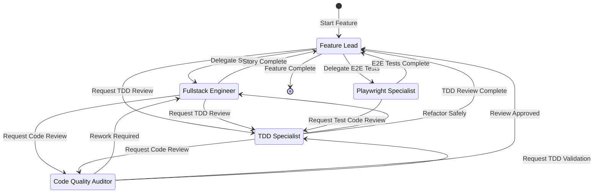
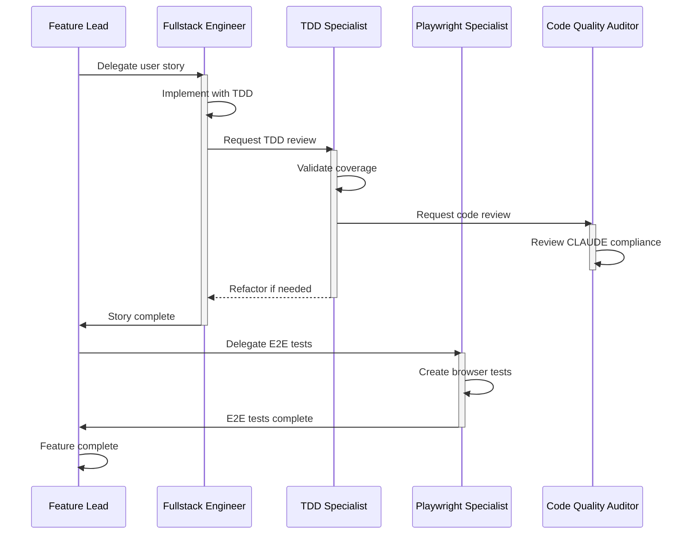

# Product Development Workflow

Agent handoff state diagrams documenting how agents coordinate during feature development.

## Complete Handoff Map

```
┌─────────────────────────────────────────────────────────────────────────────────┐
│                           AGENT HANDOFF WORKFLOW                                 │
└─────────────────────────────────────────────────────────────────────────────────┘

                              ┌──────────────────┐
                              │   FEATURE LEAD   │◄─────────────────────────────┐
                              │   (Orchestrator) │                              │
                              └────────┬─────────┘                              │
                                       │                                        │
           ┌───────────────────────────┼───────────────────────────┐            │
           │                           │                           │            │
           ▼                           ▼                           ▼            │
┌──────────────────┐      ┌──────────────────┐      ┌──────────────────────┐    │
│    FULLSTACK     │◄─────│  TDD SPECIALIST  │◄─────│ PLAYWRIGHT SPECIALIST│    │
│    ENGINEER      │      │                  │      │    (E2E Testing)     │    │
└────────┬─────────┘      └────────┬─────────┘      └──────────┬───────────┘    │
         │                         │  ▲                        │               │
         │                         │  │                        │               │
         ▼                         ▼  │                        │               │
┌──────────────────┐      ┌──────────────────┐                 │               │
│  TDD SPECIALIST  │─────►│  CODE QUALITY    │                 │               │
│                  │      │    AUDITOR       │─────────────────┼───────────────┘
└──────────────────┘      └────────┬─────────┘                 │
                                   │                           │
                                   └───────────────────────────┘
                                     (Routes to: Fullstack, Feature Lead, TDD)

═══════════════════════════════════════════════════════════════════════════════════
                              POST-MERGE WORKFLOW
═══════════════════════════════════════════════════════════════════════════════════

┌──────────────────┐      ┌───────────────────┐      ┌─────────────────────────┐
│   FEATURE LEAD   │─────►│ RETRO SPECIALIST  │─────►│ AGENT PACKAGE MANAGER   │
│ (Story Merged)   │      │  (Facilitates)    │      │ (Implements Changes)    │
└──────────────────┘      └─────────┬─────────┘      └─────────────────────────┘
                                    │
                          ┌─────────┴─────────┐
                          │ Gathers Input From│
                          ├───────────────────┤
                          │ • TDD Specialist  │
                          │ • Fullstack Eng   │
                          │ • Playwright Spec │
                          │ • Code Quality    │
                          └───────────────────┘
```

## Agents Overview

| Agent | Role | Phase | Model |
|-------|------|-------|-------|
| **feature-lead** | Orchestrator - coordinates multi-story features | Development | Claude Opus 4.5 |
| **fullstack-engineer** | Implementation - builds production-ready code | Development | Claude Sonnet 4.5 |
| **tdd-specialist** | Quality - enforces TDD discipline | Development | Claude Sonnet 4.5 |
| **playwright-specialist** | E2E Testing - browser automation | Integration | Claude Sonnet 4.5 |
| **code-quality-auditor** | Review - CLAUDE Framework compliance | Quality Gate | Claude Sonnet 4.5 |
| **retro-specialist** | Facilitation - runs retrospectives, synthesizes learnings | Post-Merge | Claude Sonnet 4.5 |
| **agent-package-manager** | Maintenance - implements process improvements | Continuous | Claude Sonnet 4.5 |

## Handoff Table

| From Agent | To Agent | Trigger Label | Auto-Send | Purpose |
|------------|----------|---------------|-----------|---------|
| **feature-lead** | fullstack-engineer | "Delegate to Fullstack Engineer" | ✅ | Implement user story |
| **feature-lead** | tdd-specialist | "Request TDD Review" | ✅ | Review test coverage |
| **feature-lead** | playwright-specialist | "Delegate E2E Test Automation" | ✅ | Create E2E tests |
| **fullstack-engineer** | tdd-specialist | "Request TDD Review" | ✅ | Review TDD compliance |
| **fullstack-engineer** | feature-lead | "Report Completion to Feature Lead" | ✅ | Story complete |
| **fullstack-engineer** | code-quality-auditor | "Request Code Quality Review" | ✅ | CLAUDE Framework review |
| **tdd-specialist** | code-quality-auditor | "Request Code Review" | ✅ | Review quality |
| **tdd-specialist** | fullstack-engineer | "Refactor Safely" | ✅ | Keep tests passing |
| **tdd-specialist** | feature-lead | "TDD Review Complete" | ✅ | Return to orchestrator |
| **playwright-specialist** | feature-lead | "E2E Tests Complete" | ✅ | Automation done |
| **playwright-specialist** | tdd-specialist | "Request Test Code Review" | ✅ | Review E2E test quality |
| **code-quality-auditor** | fullstack-engineer | "Rework Required" | ✅ | Fix identified issues |
| **code-quality-auditor** | feature-lead | "Review Approved" | ✅ | Quality gate passed |
| **code-quality-auditor** | tdd-specialist | "Request TDD Validation" | ✅ | Validate test coverage |
| **feature-lead** | retro-specialist | "Run Story Retrospective" | ✅ | Facilitate retro after merge |
| **retro-specialist** | agent-package-manager | "Implement Process Improvements" | ✅ | Update primitives + propagate to dependent projects |
| **retro-specialist** | feature-lead | "Retro Complete" | ✅ | Return to orchestrator |

> **Note**: All handoffs are autonomous (`send: true`) - no manual approval required.

## Workflow Paths

### Path 1: Standard Feature Development

The primary workflow for implementing user stories:

```
┌──────────────┐     ┌───────────────────┐     ┌────────────────┐     ┌─────────────────────┐
│ Feature Lead │────►│ Fullstack Engineer│────►│ TDD Specialist │────►│ Code Quality Auditor│
└──────────────┘     └─────────┬─────────┘     └────────────────┘     └─────────────────────┘
       ▲                       │                                                │
       │                       │                                                │
       └───────────────────────┴────────────────────────────────────────────────┘
                                    Story Complete
```

**Steps**:
1. Feature Lead delegates user story to Fullstack Engineer
2. Fullstack Engineer implements with TDD discipline
3. Fullstack Engineer requests TDD review
4. TDD Specialist validates coverage and compliance
5. TDD Specialist requests code quality review
6. Code Quality Auditor reviews against CLAUDE Framework
7. Fullstack Engineer reports completion to Feature Lead

### Path 2: E2E Test Automation

Parallel path for end-to-end testing:

```
┌──────────────┐     ┌───────────────────────┐     ┌──────────────┐
│ Feature Lead │────►│ Playwright Specialist │────►│ Feature Lead │
└──────────────┘     └───────────────────────┘     └──────────────┘
```

**Steps**:
1. Feature Lead delegates E2E test creation
2. Playwright Specialist creates comprehensive tests
3. Playwright Specialist reports completion with test status

### Path 3: TDD Refactoring Cycle

Iterative loop for code improvement:

```
┌────────────────┐     ┌───────────────────┐
│ TDD Specialist │◄───►│ Fullstack Engineer│
└───────┬────────┘     └───────────────────┘
        │                    (Refactor)
        ▼
┌─────────────────────┐
│ Code Quality Auditor│
└─────────────────────┘
```

**Steps**:
1. TDD Specialist identifies refactoring needs
2. Fullstack Engineer refactors while keeping tests passing
3. TDD Specialist validates tests still pass
4. TDD Specialist requests final code review

### Path 4: Retrospective and Continuous Improvement

Post-merge learning cycle:

```
┌──────────────┐     ┌──────────────────┐     ┌─────────────────────────┐
│ Feature Lead │────►│ Retro Specialist │────►│ Agent Package Manager   │
└──────────────┘     └────────┬─────────┘     └─────────────────────────┘
    (Merged)                  │                   (Implements Changes)
                              │
                    ┌─────────┴─────────┐
                    │  Gathers Input:   │
                    │  • TDD Specialist │
                    │  • Fullstack Eng  │
                    │  • Playwright     │
                    │  • Code Quality   │
                    └───────────────────┘
```

**Steps**:
1. Feature Lead triggers retro after story merge
2. Retro Specialist gathers structured YAML input from all contributors
3. Retro Specialist synthesizes successes and improvements
4. Retro Specialist creates handoff spec for Agent Package Manager
5. Agent Package Manager implements process improvements:
   - **Update**: Modify primitives (agents, prompts, instructions)
   - **Version**: Bump version in `apm.yml` (MANDATORY for any primitive change)
   - **Commit**: Push to agent-packages repository
   - **Propagate**: Run `apm install --update` in dependent projects (e.g., birdmate)
   - **Dependencies**: Add new primitives to project's `apm.yml` if created
   - **Validate**: Verify integration in `.github/` or `.claude/` directories
6. Agent Package Manager updates `.memory/retro-log.md` and commits to dependent projects

## State Diagram (Mermaid)



## Sequence Diagram: Complete Feature



## Development Standards

### TDD Commit Convention

All commits during implementation use emoji prefixes for cycle visibility:

```bash
🔴 RED: "test for similarity edge cases"
🟢 GREEN: "implement similarity clamping"
♻️ REFACTOR: "extract normalization helper"
```

This provides an auditable trail of TDD discipline in git history.

### Quality Gate Timing

| Gate | When | Required | Tools/Templates |
|------|------|----------|------------------|
| **Component Mini-Audit** | After each component | < 2 issues | CLAUDE spot-check |
| **TDD Compliance** | During implementation | 0 violations | `tdd-compliance.checklist.md` |
| **Full CLAUDE Audit** | Before merge | Grade C+ (21/30) | `claude-audit.checklist.md` |
| **E2E Tests** | Integration complete | 100% passing | `e2e-test-plan.checklist.md` |
| **All Tests Green** | Before merge | BLOCKING | Backend + Frontend + E2E |

**Critical**: E2E tests MUST pass to merge. No exceptions.

### Artifact Templates

Story development uses standardized templates from `.specify/templates/`:

- `story-tracker.template.md` - Progress tracking (Feature Lead)
- `tdd-compliance.checklist.md` - TDD verification (TDD Specialist)
- `delegation-brief.template.md` - Task handoff with domain context (Feature Lead)
- `claude-audit.checklist.md` - CLAUDE Framework review (Code Quality Auditor)
- `e2e-test-plan.checklist.md` - E2E testing (Playwright Specialist)
- `retro-process.md` - Retrospective workflow (Retro Specialist)

## Key Observations

### Hub-and-Spoke Model
- **Feature Lead is the central hub** - receives completion reports from all paths
- All work eventually returns to Feature Lead for coordination
- **Post-merge**: Retro Specialist becomes temporary hub for learning capture

### Quality Gates
- **TDD Specialist** is central to quality - both Fullstack Engineer and Feature Lead can request reviews
- **Code Quality Auditor** provides CLAUDE Framework validation with routing options

### Autonomous Workflow
- All handoffs use `send: true` - no manual approval bottlenecks
- Enables rapid iteration without human intervention

### Bidirectional Loops
- **TDD Specialist ↔ Fullstack Engineer**: Refactoring cycle until tests pass
- **Code Quality Auditor → Fullstack Engineer**: Rework cycle for issues found
- **Playwright Specialist → TDD Specialist**: Test quality review for E2E tests
- Supports iterative improvement

### Connected Nodes (No Dead Ends)
- **Code Quality Auditor** routes to:
  - Fullstack Engineer (rework needed)
  - Feature Lead (review approved)
  - TDD Specialist (validate test coverage)
- **Retro Specialist** routes to:
  - Agent Package Manager (implement improvements)
  - Feature Lead (retro complete)
- All agents have paths back to the orchestrator

### Continuous Improvement Loop
- **Retro Specialist** captures learnings after every story
- **Agent Package Manager** implements process improvements
- Learnings flow back into skills, agents, and templates
- Team velocity improves with each iteration

## Agent Dependencies

```
feature-lead
├── fullstack-engineer
│   ├── tdd-specialist
│   │   └── code-quality-auditor
│   └── code-quality-auditor
├── tdd-specialist
│   └── code-quality-auditor
├── playwright-specialist
└── retro-specialist (post-merge)
    └── agent-package-manager
```

## Usage

### Starting a Feature
```
@feature-lead Implement user authentication with OAuth2 support
```

Feature Lead will:
1. Break down into user stories
2. Delegate to Fullstack Engineer
3. Coordinate parallel E2E testing
4. Track progress and merge readiness

### Requesting E2E Tests
```
@playwright-specialist Test the complete checkout flow from cart to payment confirmation
```

### Direct TDD Review
```
@tdd-specialist Review test coverage for the user service module
```

### Running Retrospective
```
@retro-specialist Run retrospective for US-001 Bird Search feature
```

Retro Specialist will:
1. Gather structured input from all contributors
2. Synthesize successes and improvements
3. Create handoff spec for Agent Package Manager
4. Facilitate continuous improvement

---

**Last Updated**: 2025-12-25  
**Version**: 2.0 - Added retrospective workflow and quality gates
