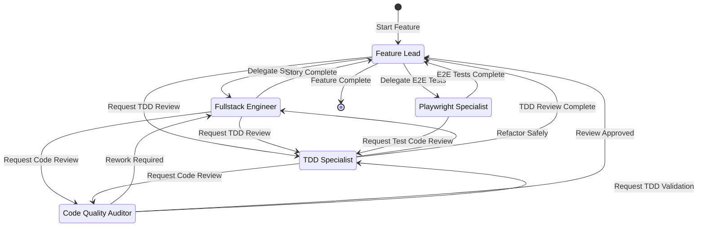
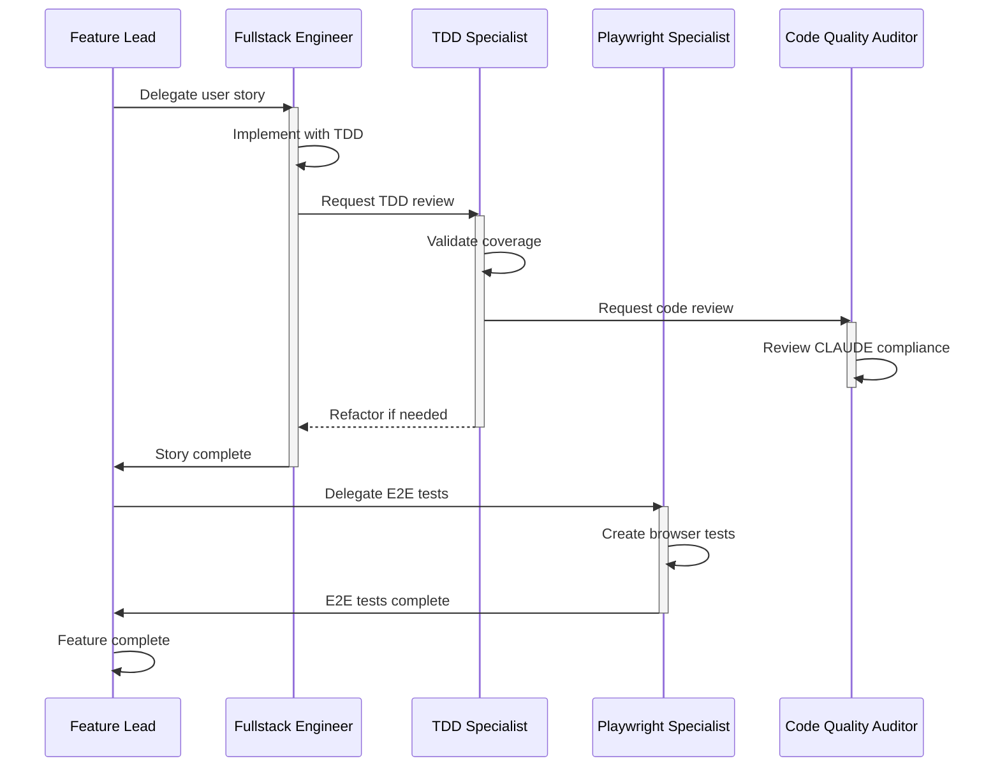

# Product Development Workflow

Agent handoff state diagrams documenting how agents coordinate during feature development.

## Complete Handoff Map

```
┌─────────────────────────────────────────────────────────────────────────────────┐
│                           AGENT HANDOFF WORKFLOW                                 │
└─────────────────────────────────────────────────────────────────────────────────┘

                              ┌──────────────────┐
                              │   FEATURE LEAD   │◄─────────────────────────────┐
                              │   (Orchestrator) │                              │
                              └────────┬─────────┘                              │
                                       │                                        │
           ┌───────────────────────────┼───────────────────────────┐            │
           │                           │                           │            │
           ▼                           ▼                           ▼            │
┌──────────────────┐      ┌──────────────────┐      ┌──────────────────────┐    │
│    FULLSTACK     │◄─────│  TDD SPECIALIST  │◄─────│ PLAYWRIGHT SPECIALIST│    │
│    ENGINEER      │      │                  │      │    (E2E Testing)     │    │
└────────┬─────────┘      └────────┬─────────┘      └──────────┬───────────┘    │
         │                         │  ▲                        │               │
         │                         │  │                        │               │
         ▼                         ▼  │                        │               │
┌──────────────────┐      ┌──────────────────┐                 │               │
│  TDD SPECIALIST  │─────►│  CODE QUALITY    │                 │               │
│                  │      │    AUDITOR       │─────────────────┼───────────────┘
└──────────────────┘      └────────┬─────────┘                 │
                                   │                           │
                                   └───────────────────────────┘
                                     (Routes to: Fullstack, Feature Lead, TDD)
```

## Agents Overview

| Agent | Role | Model |
|-------|------|-------|
| **feature-lead** | Orchestrator - coordinates multi-story features | Claude Opus 4.5 |
| **fullstack-engineer** | Implementation - builds production-ready code | Claude Sonnet 4.5 |
| **tdd-specialist** | Quality - enforces TDD discipline | Claude Sonnet 4.5 |
| **playwright-specialist** | E2E Testing - browser automation | Claude Sonnet 4.5 |
| **code-quality-auditor** | Review - CLAUDE Framework compliance | Claude Sonnet 4.5 |

## Handoff Table

| From Agent | To Agent | Trigger Label | Auto-Send | Purpose |
|------------|----------|---------------|-----------|---------|
| **feature-lead** | fullstack-engineer | "Delegate to Fullstack Engineer" | ✅ | Implement user story |
| **feature-lead** | tdd-specialist | "Request TDD Review" | ✅ | Review test coverage |
| **feature-lead** | playwright-specialist | "Delegate E2E Test Automation" | ✅ | Create E2E tests |
| **fullstack-engineer** | tdd-specialist | "Request TDD Review" | ✅ | Review TDD compliance |
| **fullstack-engineer** | feature-lead | "Report Completion to Feature Lead" | ✅ | Story complete |
| **fullstack-engineer** | code-quality-auditor | "Request Code Quality Review" | ✅ | CLAUDE Framework review |
| **tdd-specialist** | code-quality-auditor | "Request Code Review" | ✅ | Review quality |
| **tdd-specialist** | fullstack-engineer | "Refactor Safely" | ✅ | Keep tests passing |
| **tdd-specialist** | feature-lead | "TDD Review Complete" | ✅ | Return to orchestrator |
| **playwright-specialist** | feature-lead | "E2E Tests Complete" | ✅ | Automation done |
| **playwright-specialist** | tdd-specialist | "Request Test Code Review" | ✅ | Review E2E test quality |
| **code-quality-auditor** | fullstack-engineer | "Rework Required" | ✅ | Fix identified issues |
| **code-quality-auditor** | feature-lead | "Review Approved" | ✅ | Quality gate passed |
| **code-quality-auditor** | tdd-specialist | "Request TDD Validation" | ✅ | Validate test coverage |

> **Note**: All handoffs are autonomous (`send: true`) - no manual approval required.

## Workflow Paths

### Path 1: Standard Feature Development

The primary workflow for implementing user stories:

```
┌──────────────┐     ┌───────────────────┐     ┌────────────────┐     ┌─────────────────────┐
│ Feature Lead │────►│ Fullstack Engineer│────►│ TDD Specialist │────►│ Code Quality Auditor│
└──────────────┘     └─────────┬─────────┘     └────────────────┘     └─────────────────────┘
       ▲                       │                                                │
       │                       │                                                │
       └───────────────────────┴────────────────────────────────────────────────┘
                                    Story Complete
```

**Steps**:
1. Feature Lead delegates user story to Fullstack Engineer
2. Fullstack Engineer implements with TDD discipline
3. Fullstack Engineer requests TDD review
4. TDD Specialist validates coverage and compliance
5. TDD Specialist requests code quality review
6. Code Quality Auditor reviews against CLAUDE Framework
7. Fullstack Engineer reports completion to Feature Lead

### Path 2: E2E Test Automation

Parallel path for end-to-end testing:

```
┌──────────────┐     ┌───────────────────────┐     ┌──────────────┐
│ Feature Lead │────►│ Playwright Specialist │────►│ Feature Lead │
└──────────────┘     └───────────────────────┘     └──────────────┘
```

**Steps**:
1. Feature Lead delegates E2E test creation
2. Playwright Specialist creates comprehensive tests
3. Playwright Specialist reports completion with test status

### Path 3: TDD Refactoring Cycle

Iterative loop for code improvement:

```
┌────────────────┐     ┌───────────────────┐
│ TDD Specialist │◄───►│ Fullstack Engineer│
└───────┬────────┘     └───────────────────┘
        │                    (Refactor)
        ▼
┌─────────────────────┐
│ Code Quality Auditor│
└─────────────────────┘
```

**Steps**:
1. TDD Specialist identifies refactoring needs
2. Fullstack Engineer refactors while keeping tests passing
3. TDD Specialist validates tests still pass
4. TDD Specialist requests final code review

## State Diagram (Mermaid)



## Sequence Diagram: Complete Feature



## Key Observations

### Hub-and-Spoke Model
- **Feature Lead is the central hub** - receives completion reports from all paths
- All work eventually returns to Feature Lead for coordination

### Quality Gates
- **TDD Specialist** is central to quality - both Fullstack Engineer and Feature Lead can request reviews
- **Code Quality Auditor** provides CLAUDE Framework validation with routing options

### Autonomous Workflow
- All handoffs use `send: true` - no manual approval bottlenecks
- Enables rapid iteration without human intervention

### Bidirectional Loops
- **TDD Specialist ↔ Fullstack Engineer**: Refactoring cycle until tests pass
- **Code Quality Auditor → Fullstack Engineer**: Rework cycle for issues found
- **Playwright Specialist → TDD Specialist**: Test quality review for E2E tests
- Supports iterative improvement

### Connected Nodes (No Dead Ends)
- **Code Quality Auditor** routes to:
  - Fullstack Engineer (rework needed)
  - Feature Lead (review approved)
  - TDD Specialist (validate test coverage)
- All agents have paths back to the orchestrator

## Agent Dependencies

```
feature-lead
├── fullstack-engineer
│   ├── tdd-specialist
│   │   └── code-quality-auditor
│   └── code-quality-auditor
├── tdd-specialist
│   └── code-quality-auditor
└── playwright-specialist
```

## Usage

### Starting a Feature
```
@feature-lead Implement user authentication with OAuth2 support
```

Feature Lead will:
1. Break down into user stories
2. Delegate to Fullstack Engineer
3. Coordinate parallel E2E testing
4. Track progress and merge readiness

### Requesting E2E Tests
```
@playwright-specialist Test the complete checkout flow from cart to payment confirmation
```

### Direct TDD Review
```
@tdd-specialist Review test coverage for the user service module
```
